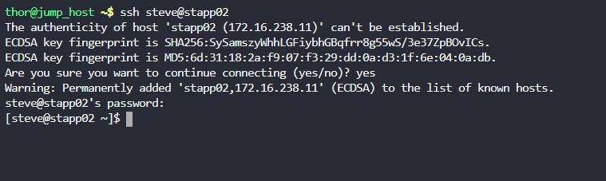
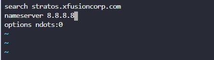
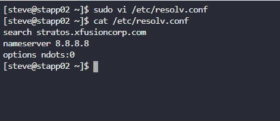

## TASK

---

The system admins team of xFusionCorp Industries has noticed intermittent issues with DNS resolution in several apps . App Server 2 in Stratos Datacenter is having some DNS resolution issues, so we want to add some additional DNS nameservers on this server.

**As a temporary fix we have decided to go with Google public DNS (ipv4). Please make appropriate changes on this server.**

---

## SOLUTION

---

1. Secure Shell login into app server 2

   

2. Editing the resolv.conf file to add the Google DNS ip

   

3. Viewing the changes made to resolv.conf file

   
