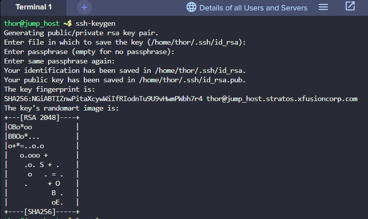
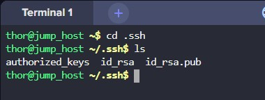
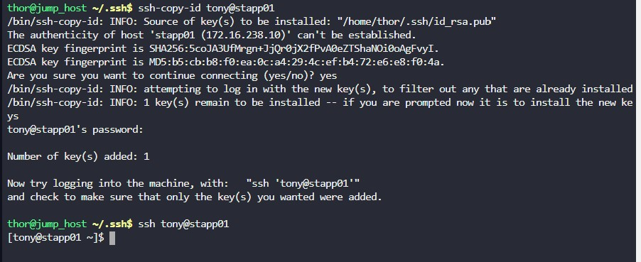
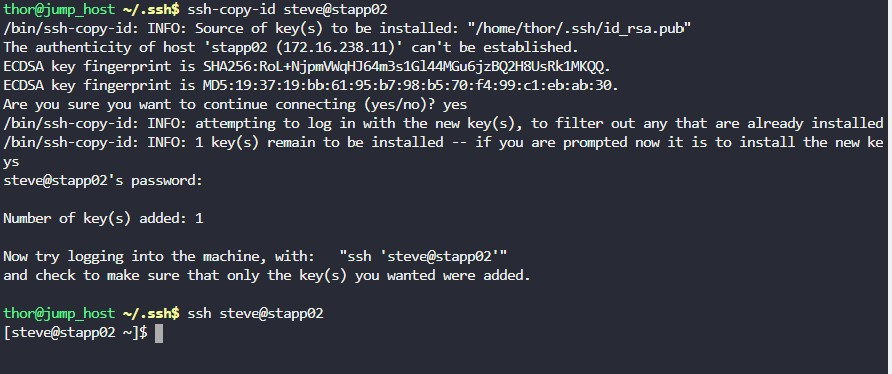
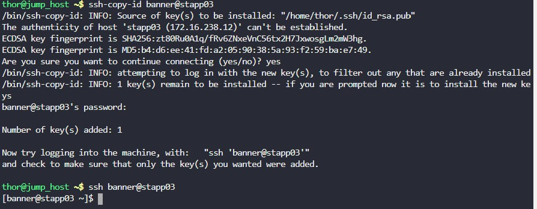

## TASK

---

The system admins team of xFusionCorp Industries has set up some scripts on jump host that run on regular intervals and perform operations on all app servers in Stratos Datacenter. To make these scripts work properly we need to make sure the thor user on jump host has password-less SSH access to all app servers through their respective sudo users (i.e tony for app server 1). Based on the requirements, perform the following:

**Set up a password-less authentication from user thor on jump host to all app servers through their respective sudo users.**

---

## SOLUTION

1. Check if the user thor has a public ssh key in the .ssh folder by searching for the id_rsa.pub file
   
    

2. If it is not there, create a new ssh key

    

3. Both the public and private keys are created in the .ssh folder

    

4. Copy the ssh id_rsa.pub key to all three strastos app servers and ssh into the app servers to test the password-less ssh connectivity

    

    

    