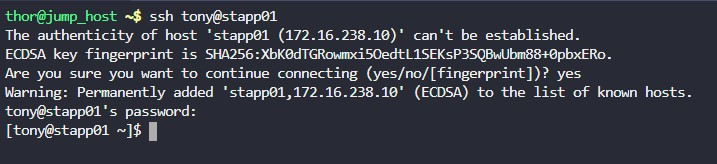
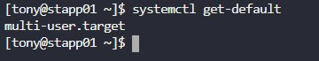
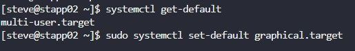
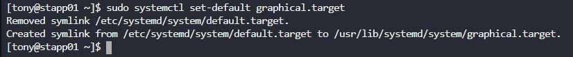
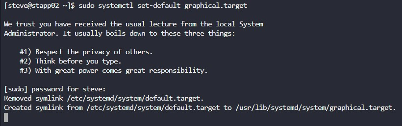

## TASK

---

New tools have been installed on the app server in Stratos Datacenter. Some of these tools can only be managed from the graphical user interface. Therefore, there are requirements for these app servers.

**On all App servers in Stratos Datacenter change the default runlevel so that they can boot in GUI (graphical user interface) by default. Please do not try to reboot these servers.**  

---

## WHAT IS RUN LEVEL AND TARGET IN LINUX SYSTEM

On Unix-like systems such as Linux, the current operating state of the operating system is known as a runlevel or target.

Target/run levels are different states that your system can boot into and it defines what system services are running on that machine. Init systems like System V init uses run levels and are identified by numbers. When linux based system start booting. systen V init select one of available target and load services accordingly 

---
| Run level   | Target              | Explanation  |  
| :---        | :---                | :---         | 
| 0           | runlevel0.target    | This run level is used to power-off or halt the system
| 1           | runlevel1.target    | This run level is used to boot the system in recovery mode. 
| 3           | runlevel3.target    | This run level is used to boot system into multi-user environment so user can work in parallel
| 5           |  runlevel5.target   | This run level is used to boot system into multi-user graphical environment so user can work in parallel in graphical mode
| 6           | runlevel6.target    | This run level is used to reboot the system  

Systemd is a modern init system for Linux: a system and service manager which is compatible with the popular SysV init system and Linux Standard Base init scripts. It was intended to overcome the shortcomings of SysV init. In systemd, runlevels are referred to as targets. systemctl is the systemd command for managing target units.

---
| Target              | Explanation  |  
| :---                | :---         | 
| default.target      | The target that is booted by default. This is a symbolic link to another target, like graphical.target
| rescue.target       | This target is used by systemd to boot the system in rescue or recovery mode
| multi-user.target   | This target is used by systemd to boot system into multi-user environment so user can work in parallel 
| graphical.target    | This target is used by systemd to boot system into multi-user graphical environment so user can work in parallel in graphical mode
|  reboot.target      | This target is used by systemd to reboot the system
| emergency.target    | This target is used by systemd to mount the root file system as read-only, does not attempt to mount any other local file systems, does not activate network interfaces.
| poweroff.target    | This target is used by systemd to turn off the system

---

## SOLUTION

1. ssh into app server one and two
   
     

   

2. check for the current default linux run level which is multi-user.target

    

    

3. use sudo as administrator priviledge to change the multi-user.target to graphical.target

    

    

4. ssh, get default, and use sudo as administrator priviledge to change default for app server3

    

